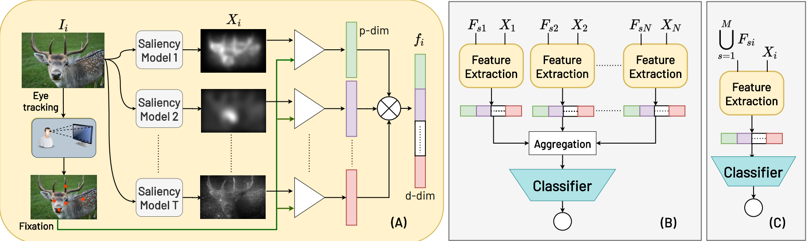

# Classifying Eye-Tracking Data Using Saliency Maps



This repository contains the code for the conference paper presented in International Conference on Pattern Recognition
(ICPR) :

*Shafin Rahman, Sejuti Rahman, Omar Shahid, Md. Tahmeed Abdullah and Jubair Ahmed Sourov "Classifying Eye-Tracking Data Using Saliency Maps", ICPR, 2020*

[Read the arXiv version of the paper](https://arxiv.org/pdf/2010.12913.pdf)

#### To cite the arXiv version
```
@misc{rahman2020classifying,
      title={Classifying Eye-Tracking Data Using Saliency Maps}, 
      author={Shafin Rahman and Sejuti Rahman and Omar Shahid and Md. Tahmeed Abdullah and Jubair Ahmed Sourov},
      year={2020},
      eprint={2010.12913},
      archivePrefix={arXiv},
      primaryClass={cs.CV}
}

```

## Datasets

+ [Sliency4ASD](https://saliency4asd.ls2n.fr/datasets/)
+ [Toddlers Viewing Natural Scenes](https://osf.io/ugvj4/)
+ Visual Perceptual Task Dataset

## How to Extract Features?

## Classification


